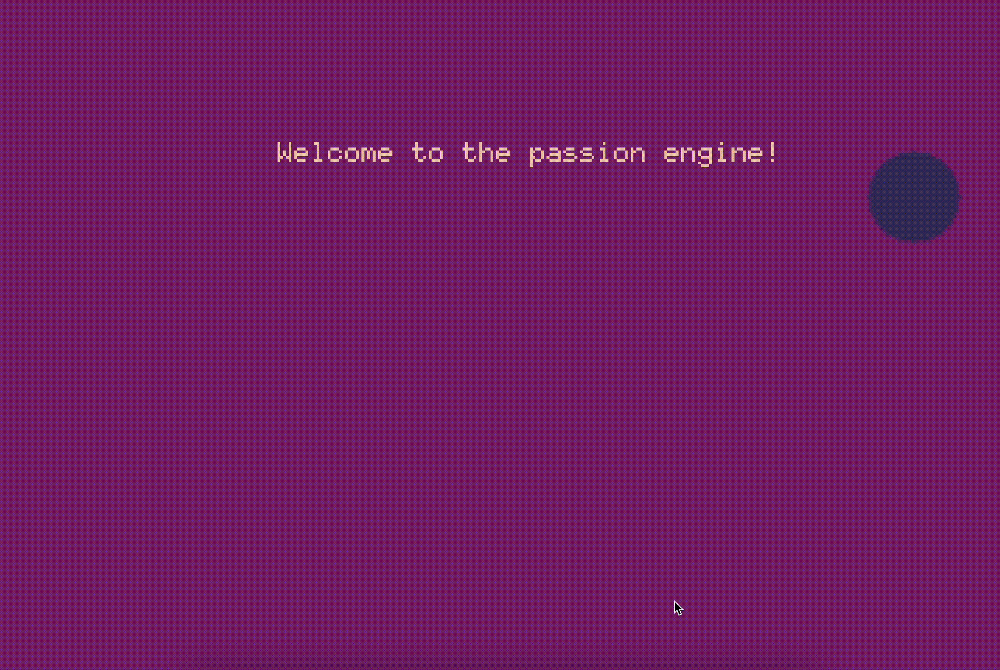

# Create a Minimal Project

Welcome to this step-by-step guide for setting up a minimal project using the Passion Game engine! The Passion engine is a TypeScript-based framework for creating 2D games in the browser. You can find more information about the engine here: https://github.com/dmitrii-eremin/passion-ts

This guide will walk you through the process of creating a simple web game from scratch. It is designed for developers who are already comfortable with programming basics, TypeScript, Node.js, and modern JavaScript tooling.



## Install Dependencies
To begin, create a new folder for your project. In this example, we'll call it `my-wonderful-game`, but you can choose any name you like. Open your terminal, navigate to this folder, and initialize a new Node.js project:
```bash
npm init
npm i @dmitrii-eremin/passion-engine
```
The Passion engine will be installed as a dependency. To build and serve your game in the browser, this guide uses [Vite](https://vitejs.dev/), a fast and modern frontend build tool. Install the required development dependencies:
```bash
npm install --save-dev vite typescript @types/node
```
These packages provide a fast development server, TypeScript support, and type definitions for Node.js.

## Web Page with Game Container
Now, let's set up the files needed to run your web game. We'll configure Vite, TypeScript, and create the HTML and CSS for your game.

### 1. Vite Configuration
Create a file named `vite.config.ts` in the root directory of your project. This file tells Vite how to build and serve your project:
```ts
import { defineConfig } from 'vite';

export default defineConfig({
  root: '.',
  build: {
    outDir: 'dist',
  },
});
```
This configuration sets the root directory and specifies that the build output should go into a `dist` folder.

### 2. TypeScript Configuration
Next, add a `tsconfig.json` file to the root of your project. This file configures the TypeScript compiler options:
```json
{
  "compilerOptions": {
    "target": "ESNext",
    "module": "ESNext",
    "moduleResolution": "Node",
    "strict": true,
    "esModuleInterop": true,
    "skipLibCheck": true,
    "forceConsistentCasingInFileNames": true,
    "outDir": "dist"
  },
  "include": ["src"]
}
```
This setup ensures your TypeScript code is compiled to modern JavaScript and output to the `dist` directory. The `strict` flag enables strict type checking for safer code.

### 3. Main HTML File
Create an `index.html` file in the root folder. This will be the main web page for your game. The example below includes a `<canvas>` element with the id `app`, which the Passion engine will use for rendering:
```html
<!DOCTYPE html>
<html lang="en">
  <head>
    <meta charset="UTF-8" />
    <meta name="viewport" content="width=device-width, initial-scale=1.0" />
    <title>My Wonderful Game!</title>
  </head>
  <body>
    <!-- The canvas with id 'app' is where your game will be rendered -->
    <canvas id="app"></canvas>
    <script type="module" src="/src/main.ts"></script>
  </body>
</html>
```
The `<script>` tag loads your main TypeScript file, which will contain your game logic.

### 4. Source Folder and Stylesheet
Create a folder named `src` in your project root. This is where all your TypeScript and CSS files will go.

Inside the `src` folder, add a stylesheet named `style.css`:
```css
html, body {
  height: 100%;
  margin: 0;
  padding: 0;
  border: none;
}

#app {
  display: block;
  margin: auto;
  position: absolute;
  top: 0; left: 0; bottom: 0; right: 0;
  width: 100vw;
  height: 100vh;
  max-width: 100vw;
  max-height: 100vh;
  image-rendering: pixelated;
  image-rendering: crisp-edges;
  background: black;
  object-fit: contain;
}

#app:focus {
  outline: none;
  box-shadow: none;
}
```
This CSS ensures that your game canvas fills the entire browser window, is centered, and uses pixelated rendering for a retro look. You can customize these styles to fit your game's aesthetic.

### 5. Main TypeScript File
Now, create your main TypeScript file: `src/main.ts`. This file will initialize the Passion engine and start your game loop. Here is a minimal example:
```ts
import { Passion } from '@dmitrii-eremin/passion-engine';
import './style.css';

document.addEventListener('DOMContentLoaded', () => {
  const app = document.getElementById('app') as HTMLCanvasElement | null;
  if (app) {
    const passion = new Passion(app);

    passion.system.run(
      (dt: number) => {
        // This function is called every frame to update the game state
      },
      () => {
        // This function is called when the browser requests the engine to draw a frame
      }
    );
  }
});
```
This code waits for the DOM to load, finds the canvas element, and creates a new Passion engine instance. 

Now make sure, that your `package.json` looks like this:
```json
{
  "name": "passion-ts-example",
  "version": "1.0.0",
  "description": "An example of passion game engine usage",
  "license": "ISC",
  "author": "Dmitrii Eremin <erem.dmitrii@gmail.com>",
  "type": "commonjs",
  "main": "index.js",
  "scripts": {
    "dev": "vite",
    "build": "vite build",
    "preview": "vite preview",
    "test": "echo \"Error: no test specified\" && exit 1"
  },
  "dependencies": {
    "@dmitrii-eremin/passion-engine": "^1.0.116"
  },
  "devDependencies": {
    "@types/node": "^24.0.10",
    "typescript": "^5.8.3",
    "vite": "^7.0.2"
  }
}
```

After that, the `npm run dev` starts the dev server, so you can go in browser to the address you can see in the terminal.
Congratulations! You now have a minimal setup for a Passion engine game.

## Making the Game Interactive
Let's enhance your game by adding some simple logic and rendering. Replace the contents of `src/main.ts` with the following code to create a bouncing ball and display a welcome message:
```ts
import { Passion } from '@dmitrii-eremin/passion-engine';
import './style.css';

document.addEventListener('DOMContentLoaded', () => {
  const app = document.getElementById('app') as HTMLCanvasElement | null;
  if (app) {
    debugger;
    const passion = new Passion(app);
    passion.system.init(360, 240, "My first, but wonderful game!");

    const radius = 16;
    const speed = 20;
    let x = 360 / 2;
    let y = 240 / 2;

    let dx = passion.math.rndi(-5, 5);
    let dy = passion.math.rndi(-5, 5);

    passion.system.run(
      (dt: number) => {
        // Update the ball's position every frame
        x += speed * dx * dt;
        y += speed * dy * dt;
        // Bounce off the edges of the screen
        if (x - radius <= 0 || x + radius >= passion.system.width) {
          dx = -dx;
        }
        if (y - radius <= 0 || y + radius >= passion.system.height) {
          dy = -dy;
        }
      },
      () => {
        // Clear the screen and draw the ball and welcome text
        passion.graphics.cls(2);
        passion.graphics.circ(x, y, radius, 1);
        passion.graphics.text(100, 50, 'Welcome to the Passion engine!', 15);
      }
    );
  }
});
```
In this example, a ball bounces around the screen, and a welcome message is displayed. You can use this as a starting point to experiment and build your own game mechanics.

Here is the live demo of the guide: https://dmitrii-eremin.github.io/passion-ts-example

---

And that's it! You now have a working game project using the Passion engine. From here, you can start adding your own features, graphics, and gameplay. Have fun creating your games, and don't hesitate to explore the Passion engine documentation for more advanced features!
